# Developer Machine Setup 4.0 - Organized

| [Richard Pangborn](mailto:r.pangborn@method.me) | Owner | Status | Draft |
| :---- | :---- | :---- | :---- |
| 2025-09-19 | **Last Modified** |  |  |

# Previous versions: [3.0](https://docs.google.com/document/d/1VdmFIuzEY31cbRC6Q3cBjkgGSoErRHHgljJvh_kshHg/edit?tab=t.0), [2.0](https://docs.google.com/document/d/1XwK8jg0V9jWYidg6j_xOb-RZj1h-feAe1a1riAL5VPQ), [1.0](https://docs.google.com/document/d/1Sr8Cf5USohYXMf6PJM2SSsNQkVOm0BsoYnn3Wrclyg8)

---

## 📋 Overview

This comprehensive developer setup guide has been reorganized into logical sections for better maintainability and ease of use. Each section is now contained in its own directory with focused documentation.

**📁 Organized Documentation Location:** `./`

## 📊 Documentation Structure Visualization

### Complete Directory & Link Graph

```mermaid
graph TB
    %% Main README
    Main[README.md<br/>📋 Main Guide] --> Prerequisites[prerequisites/<br/>🔧 System Setup]
    Main --> Credentials[credentials/<br/>🔑 Access Setup]
    Main --> GitHub[github-setup/<br/>📝 Source Control]
    Main --> Software[software-installation/<br/>💾 Tools Install]
    Main --> Microsoft[microsoft-tools/<br/>🏢 MS Tools]
    Main --> Environment[environment-setup/<br/>⚙️ Build Environment]
    Main --> Certificates[certificates/<br/>🔒 SSL Setup]
    Main --> IIS[iis-configuration/<br/>🌐 Web Server]
    Main --> NetCore[netcore-requirements/<br/>🎯 .NET Setup]
    Main --> LocalDev[local-development/<br/>🚀 Run Apps]
    Main --> Additional[additional-tools/<br/>🔧 Extra Tools]
    Main --> Troubleshooting[troubleshooting/<br/>🆘 Help & Debug]
    Main --> Onboarding[onboarding/<br/>👥 Team Integration]

    %% Prerequisites links
    Prerequisites --> PreReq1[windows-update.md]
    Prerequisites --> PreReq2[vpn-setup.md]
    Prerequisites --> PreReq3[d-drive-setup.md]

    %% Credentials links
    Credentials --> Cred1[active-directory.md]
    Credentials --> Cred2[msdn.md]

    %% GitHub links
    GitHub --> Git1[git-configuration.md]
    GitHub --> Git2[ssh-keys.md]
    GitHub --> Git3[repository-access.md]
    GitHub --> Git4[branching-strategy.md]
    GitHub --> Git5[development-workflow.md]

    %% Software Installation links
    Software --> SW1[developer-tools.md]
    Software --> SW2[docker-packages.md]
    Software --> SW3[sql-server.md]
    Software --> SW4[sql-aliases.md]
    Software --> SW5[ssms.md]
    Software --> SW6[sql-permissions.md]
    Software --> SW7[sql-backups.md]

    %% Microsoft Tools links
    Microsoft --> MS1[visual-studio.md]
    Microsoft --> MS2[nuget-feeds.md]
    Microsoft --> MS3[ad-credentials.md]
    Microsoft --> MS4[nunit-adapter.md]
    Microsoft --> MS5[url-rewrite.md]

    %% Environment Setup links
    Environment --> Env1[npm-path.md]
    Environment --> Env2[build-environment.md]

    %% Certificates links
    Certificates --> Cert1[download-certificate.md]
    Certificates --> Cert2[import-certificates.md]
    Certificates --> Cert3[iis-certificates.md]
    Certificates --> Cert4[browserstack.md]
    Certificates --> Cert5[custom-certificates.md]

    %% IIS Configuration links
    IIS --> IIS1[application-pools.md]
    IIS --> IIS2[performance-tuning.md]
    IIS --> IIS3[security-settings.md]
    IIS --> IIS4[ssl-certificates.md]
    IIS --> IIS5[virtual-directories.md]
    IIS --> IISAppendix[../troubleshooting/appendix-iis.md]

    %% NetCore Requirements links
    NetCore --> NC1[aspnetcore-env.md]
    NetCore --> NC2[aws-credentials.md]

    %% Local Development links
    LocalDev --> LD1[prerequisites.md]
    LocalDev --> LD2[critical-projects.md]
    LocalDev --> LD3[create-account.md]
    LocalDev --> LD4[sms-notifications.md]

    %% Additional Tools links
    Additional --> AT1[postman.md]
    Additional --> AT2[portal-setup.md]
    Additional --> AT3[audit-trail.md]
    Additional --> AT4[elasticsearch.md]
    Additional --> AT5[elasticsearch-kibana.md]
    Additional --> AT6[health-check.md]

    %% Troubleshooting links
    Troubleshooting --> TR1[general.md]
    Troubleshooting --> TR2[decision-tree.md]
    Troubleshooting --> TR3[appendix-iis.md]
    Troubleshooting --> TR4[host-file-list.md]
    Troubleshooting --> TR5[app-pools-services.md]
    Troubleshooting --> TR6[database-restore.md]
    Troubleshooting --> TR7[debug-netcore.md]
    Troubleshooting --> TR8[debug-netframework.md]
    Troubleshooting --> TR9[dns-setup.md]
    Troubleshooting --> TR10[log-files.md]
    Troubleshooting --> TR11[new-drive-setup.md]
    Troubleshooting --> TR12[nuget-issues.md]

    %% Onboarding links
    Onboarding --> OB1[checklist.md]
    Onboarding --> OB2[buddy-assignment.md]
    Onboarding --> OB3[first-week-schedule.md]
    Onboarding --> OB4[architecture-overview.md]
    Onboarding --> OB5[company-context.md]
    Onboarding --> OB6[code-review-standards.md]
    Onboarding --> OB7[first-pr-workflow.md]
    Onboarding --> OB8[learning-milestones.md]
    Onboarding --> OB9[metrics.md]
    Onboarding --> OB10[onboarding-analysis.md]
    Onboarding --> OB11[onboarding-manager-guide.md]
    Onboarding --> OB12[oncall-shadowing.md]
    Onboarding --> OB13[production-access-sop.md]
    Onboarding --> OB14[troubleshooting-skills.md]
    Onboarding --> OB15[Issues.md]

    %% Cross-references
    IIS -.-> Certificates
    Microsoft -.-> Credentials
    LocalDev -.-> IIS
    LocalDev -.-> NetCore
    Environment -.-> Software
    
    %% Styling
    classDef mainNode fill:#e1f5fe,stroke:#01579b,stroke-width:3px
    classDef setupNode fill:#f3e5f5,stroke:#4a148c,stroke-width:2px
    classDef toolNode fill:#e8f5e8,stroke:#1b5e20,stroke-width:2px
    classDef helpNode fill:#fff3e0,stroke:#e65100,stroke-width:2px
    
    class Main mainNode
    class Prerequisites,Credentials,GitHub,Software,Microsoft,Environment setupNode
    class Certificates,IIS,NetCore,LocalDev,Additional toolNode
    class Troubleshooting,Onboarding helpNode
```

### User Setup Flow Diagram

```mermaid
flowchart TD
    Start([🚀 New Developer<br/>Machine Setup]) --> Check{Admin Rights?}
    Check -->|No| GetAdmin[Get Administrator Access]
    GetAdmin --> Check
    Check -->|Yes| Step1[📋 1. Prerequisites<br/>Windows Updates, VPN, D: Drive]
    
    Step1 --> Step2[🔑 2. Credentials<br/>AD & MSDN Access]
    Step2 --> Step3[📝 3. GitHub Setup<br/>Git, SSH, Access Tokens]
    Step3 --> Step4[💾 4. Software Installation<br/>Developer Tools, Docker, SQL]
    Step4 --> Step5[🏢 5. Microsoft Tools<br/>Visual Studio, NuGet, URL Rewrite]
    Step5 --> Step6[⚙️ 6. Environment Setup<br/>NPM Paths, Build Environment]
    Step6 --> Step7[🔒 7. Certificates<br/>SSL Certificate Download & Import]
    Step7 --> Step8[🌐 8. IIS Configuration<br/>Web Server Setup & Sites]
    Step8 --> Step9[🎯 9. NetCore Requirements<br/>Environment Variables, AWS]
    Step9 --> Step10[🚀 10. Local Development<br/>Run Apps, Create Accounts]
    
    Step10 --> Validate{All Services<br/>Running?}
    Validate -->|No| Debug[🆘 Troubleshooting<br/>Check logs, fix issues]
    Debug --> Validate
    Validate -->|Yes| Success([✅ Setup Complete!<br/>Ready for Development])
    
    %% Parallel Optional Steps
    Step10 -.-> Optional1[🔧 Additional Tools<br/>Postman, Elasticsearch]
    Step1 -.-> Optional2[👥 Onboarding<br/>Team Integration Process]
    
    %% Support Links
    Debug --> TR_General[troubleshooting/general.md]
    Debug --> TR_Decision[troubleshooting/decision-tree.md]
    Debug --> TR_IIS[troubleshooting/appendix-iis.md]
    Debug --> TR_Hosts[troubleshooting/host-file-list.md]
    
    %% Styling
    classDef startEnd fill:#e8f5e8,stroke:#2e7d32,stroke-width:3px
    classDef process fill:#e3f2fd,stroke:#1565c0,stroke-width:2px
    classDef decision fill:#fff3e0,stroke:#ef6c00,stroke-width:2px
    classDef optional fill:#f3e5f5,stroke:#7b1fa2,stroke-width:1px,stroke-dasharray: 5 5
    classDef trouble fill:#ffebee,stroke:#c62828,stroke-width:2px
    
    class Start,Success startEnd
    class Step1,Step2,Step3,Step4,Step5,Step6,Step7,Step8,Step9,Step10,GetAdmin process
    class Check,Validate decision
    class Optional1,Optional2 optional
    class Debug,TR_General,TR_Decision,TR_IIS,TR_Hosts trouble
```

### Dependency & Prerequisites Flow

---

## 🚀 Quick Start Path

For new developers, follow this path:

1. **[Prerequisites](./prerequisites/README.md)** - Essential system setup
2. **[Credentials](./credentials/README.md)** - Get your access credentials
3. **[GitHub Setup](./github-setup/README.md)** - Source control configuration
4. **[Software Installation](./software-installation/README.md)** - Install required tools
5. **[Microsoft Tools](./microsoft-tools/README.md)** - Visual Studio and development tools
6. **[Environment Setup](./environment-setup/README.md)** - Build environment
7. **[Certificates](./certificates/README.md)** - SSL certificates for HTTPS
8. **[IIS Configuration](./iis-configuration/README.md)** - Web server setup
9. **[NetCore Requirements](./netcore-requirements/README.md)** - .NET Core environment
10. **[Local Development](./local-development/README.md)** - Run applications locally

## 📖 Complete Section Guide

### Core Setup Sections

| Section | Description |
|---------|-------------|
| [Prerequisites](./prerequisites/README.md) | Windows updates, VPN, drive setup |
| [Credentials](./credentials/README.md) | AD and MSDN credentials |
| [GitHub Setup](./github-setup/README.md) | Git, SSH keys, access tokens |
| [Software Installation](./software-installation/README.md) | Developer tools, Docker, SQL Server |
| [Microsoft Tools](./microsoft-tools/README.md) | Visual Studio, NuGet configuration |
| [Environment Setup](./environment-setup/README.md) | NPM paths, build environment |
| [Certificates](./certificates/README.md) | SSL certificates and HTTPS setup |
| [IIS Configuration](./iis-configuration/README.md) | Web server and site configuration |
| [NetCore Requirements](./netcore-requirements/README.md) | Environment variables, AWS setup |
| [Local Development](./local-development/README.md) | Running projects, creating accounts |

### Additional Tools & Resources

| Section | Description | When Needed |
|---------|-------------|-------------|
| [Additional Tools](./additional-tools/README.md) | Postman, Portal, Elasticsearch | As required |
| [Troubleshooting](./troubleshooting/README.md) | Common issues and solutions | When problems occur |

## 🔗 Quick Reference Links

- **Host File Entries:** [troubleshooting/host-file-list.md](./troubleshooting/host-file-list.md)
- **General Troubleshooting:** [troubleshooting/general.md](./troubleshooting/general.md)
- **Health Check:** [additional-tools/health-check.md](./additional-tools/health-check.md)

## ⚠️ Important Notes

- **VPN Required:** Many setup steps require VPN connection
- **Order Matters:** Follow sections in the recommended sequence
- **Version Compatibility:** Always verify software version compatibility
- **Admin Rights:** Many installations require administrator privileges

## 📞 Getting Help

- **Slack Channels:** #team-product-troubleshooting
- **Git Administrators:** Rich, Arash
- **Documentation Issues:** Create GitHub issue in the developer tools repo

---

## 📄 Original Document

The complete original document is preserved at: `../MethodUI/Developer-Machine-Setup-3.0.md`

This organized structure makes it easier to:
- ✅ Find specific setup information quickly
- ✅ Maintain and update individual sections
- ✅ Track completion progress
- ✅ Troubleshoot specific areas
- ✅ Onboard new team members efficiently

## 💡 Setup Expectations

The setup process varies significantly based on experience level and familiarity with Method's development environment:

- **Experienced developers** familiar with our stack, project layout, and troubleshooting: ~1 day
- **New developers** or those new to our environment: typically 4-8 days

> **Note:** Duration depends on download speeds, machine performance, troubleshooting needs, and prior experience with similar development environments. Focus on following each step carefully rather than rushing through the process.
