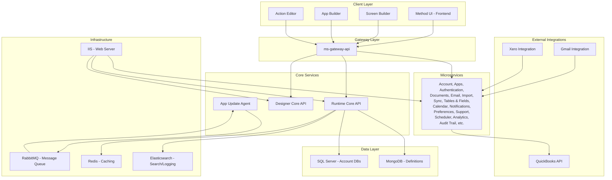

# Method Platform Architecture Overview

## What is Method?

Method is a **no-code software platform** with strong QuickBooks integration, built specifically for small to medium businesses. We provide:

- **Custom Software Solutions**: Extremely customizable software tailored to each business's unique needs
- **No-Code Development**: Users build screens and define business logic without traditional coding
- **QuickBooks Integration**: Deep integration with QuickBooks for financial data synchronization
- **CRM Capabilities**: Customer relationship management built on top of our platform

## Platform Architecture

### Core Components

### Project Structure

Our codebase is organized into several key projects:

#### Frontend Projects
- **`method-platform-ui`**: Main frontend application containing:
  - Legacy screen builder (older interface)
  - Modern app builder (newer, more powerful interface)
  - Action editor for defining business logic
  - Tables & Fields management interface

#### Backend Projects
- **`runtime-core`**: Contains multiple services:
  - **Runtime.Core.Api**: Main business logic engine that executes user-defined actions
  - **Runtime.AppUpdate.Agent**: RabbitMQ consumer that handles app installations and updates
  - **Designer.Core.Api**: Core designer functionality
  - **Event Subscribers**: Analytics, audit trail, sync, and tags event processing
- **`ms-gateway-api`**: API Gateway that routes requests to microservices using Ocelot
- **Microservices** (hosted individually in IIS):
  - **Account Services**: User and account management (both .NET Framework and .NET Core versions)
  - **Apps Service**: Application management and publishing
  - **Authentication**: User authentication and authorization
  - **Documents Service**: Document storage and management
  - **Email Service**: Email templates and sending
  - **Import Services**: Data import functionality
  - **Sync Services**: QuickBooks and Xero synchronization
  - **Tables & Fields**: Database schema and field management
  - **Calendar Service**: Calendar integration
  - **Mobile Notifications**: Push and SMS notifications
  - **Preferences**: User and account preferences
  - **Support Services**: Support ticket management
  - **Scheduler**: Task scheduling
  - **Analytics**: Usage analytics and reporting
  - **Audit Trail**: Activity logging and audit

## Database Architecture

### SQL Server Schema

Each customer account has its own dedicated SQL Server database with:

#### Spider Tables
- **Purpose**: Hold in-app table definitions that users can modify
- **Management**: Users add/modify through the "Tables & Fields" page
- **Examples**: Custom tables for contacts, orders, inventory, etc.

#### Account Tables (acc_*)
- **Purpose**: Synchronize data from QuickBooks
- **Prefix**: All QuickBooks-synced tables start with "acc_"
- **Examples**: `acc_customers`, `acc_invoices`, `acc_items`

#### Custom Tables
- **Purpose**: Business-specific data not in QuickBooks
- **Management**: Created and managed through the platform UI
- **Integration**: Can reference and relate to account tables

### MongoDB Schema

Each account also has its own MongoDB database containing:

- **Screen Definitions**: Layout, components, and configuration
- **App Definitions**: Complete app specifications
- **App Routines**: Reusable business logic components
- **User Preferences**: Customizations and configurations

### Template System

- **`TemplateDevV2`**: Development database for building new apps
- **`MethodAppStore`**: Published apps available for installation
- **Process**: Apps built in TemplateDevV2 → Published to MethodAppStore → Installed to customer accounts

## Data Flow

### App Installation Process

1. **Customer selects app** from MethodAppStore
2. **App-update service** (RabbitMQ consumer) processes installation
3. **Database schema** copied from template to customer's SQL database
4. **Screen definitions** copied to customer's MongoDB
5. **Action sets** and business logic deployed to customer environment

### Screen Building Process

1. **User opens App Builder** (legacy or modern)
2. **Drags components** onto screen canvas
3. **Configures data binding** to database tables
4. **Defines business logic** using Action Editor
5. **Saves screen definition** to MongoDB
6. **Runtime Core** executes screens and actions

## Service Architecture Details

### Gateway Routing
The **ms-gateway-api** uses Ocelot to route requests to appropriate microservices:
- Routes are configured per service (e.g., `/documents/{account}/{path}` → Documents Service)
- Account isolation through path parameters (`{method_gateway_account}`)
- Health check endpoints for monitoring service status
- Load balancing and failover capabilities

### QuickBooks Integration
- **Direct API Access**: QuickBooks APIs are accessed directly by Sync Services, not through the gateway
- **Sync Services**: Handle QuickBooks Online (QBO) and QuickBooks Desktop synchronization
- **Conflict Resolution**: Manages data conflicts between Method and QuickBooks
- **Authentication**: OAuth2 for QBO, certificate-based for Desktop

### Runtime Engine
- **Action Execution**: Processes user-defined business logic through the Runtime Core API
- **Expression Engine**: Evaluates formulas and conditional logic
- **Caching Layer**: Redis for performance optimization
- **Event Publishing**: RabbitMQ for asynchronous processing

## Key Concepts for New Developers

### No-Code Philosophy
- Users build software through visual interfaces, not code
- Business logic defined through "Actions" (Send Email, Update Record, etc.)
- Screens assembled by dragging and configuring components

### Multi-Tenant Architecture
- Each customer has isolated databases
- Shared infrastructure with tenant isolation
- Customizable at both account and user levels

### Event-Driven Design
- Actions triggered by user events (clicks, form submissions)
- Background processes handled by RabbitMQ
- Real-time updates through WebSocket connections

### Microservices Architecture
- Services are independently deployable and scalable
- Inter-service communication through HTTP APIs
- Centralized logging through Elasticsearch
- Health monitoring and service discovery

## Development Environment Goals

The ultimate goal of your local setup is to **create a working local account** that demonstrates:

1. **Database connectivity** to both SQL Server and MongoDB
2. **Screen rendering** through the Method UI
3. **Action execution** through the Runtime Core
4. **Data synchronization** with QuickBooks (simulated)
5. **App installation** from the app store

## Build Commands Reference

All build commands are defined in: `C:/MethodDev/DeveloperTools/DevSetup/build_local/projects.yaml`

Each project has a specific command that can be run in the terminal. This is your reference for building individual components.

## Log Files Location

All application logs are stored in: `D:/logs/`

This directory contains logs for all Method services and is your primary source for debugging information.

## Next Steps

After understanding this architecture:
1. Follow the [Local Development Setup](../local-development/README.md)
2. Use the [Troubleshooting Decision Tree](../troubleshooting/decision-tree.md) when issues arise
3. Reference [Company Terms](../Company%20Terms.md) for platform-specific terminology
4. Work with your buddy to create your first local account

---

**Related Documentation:**
- [Company Terms](../Company%20Terms.md) - Platform terminology
- [Local Development Setup](../local-development/README.md) - Getting started
- [Troubleshooting Guide](../troubleshooting/README.md) - Problem solving
- [Learning Milestones](./learning-milestones.md) - Progress tracking
