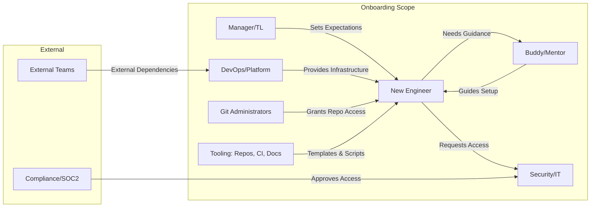
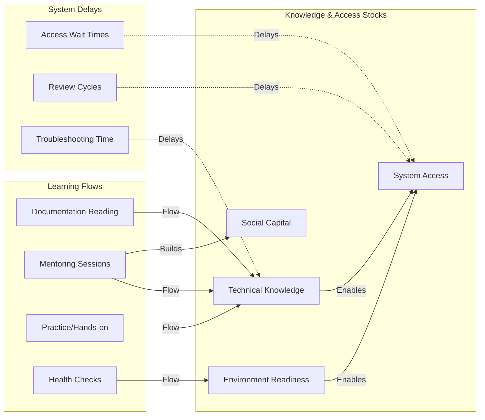
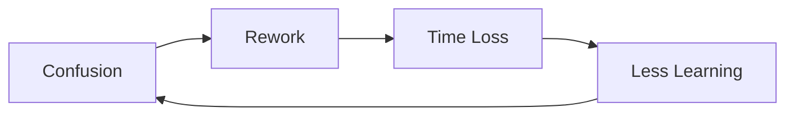
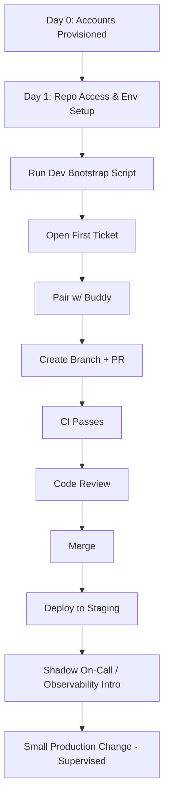
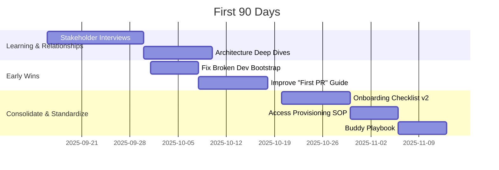

# Onboarding Documentation Analysis: Systems Thinking + First 90 Days

## 1) Executive Summary

- **Current Onboarding System:** Method's onboarding has been transformed from a fragmented technical setup process into a comprehensive learning journey that develops independent problem solvers. The new system focuses on understanding the platform architecture, developing troubleshooting skills, and creating a working local account as the primary goal.
- **STARS Context:** **Sustaining Success** — Established platform and processes with complex infrastructure suggest a stable environment where new engineers integrate into existing systems and improve them incrementally.
- **Top 5 Leverage Points:**
  - **System Understanding**: Clear explanation of Method's business model and technical architecture
  - **Troubleshooting Skills Development**: Systematic approach to problem-solving with 5 Whys and binary search
  - **Structured Learning Path**: 30/60/90 day milestones focused on independence and contribution
  - **Generous Setup Time**: Realistic scheduling with buffer time for common complications
  - **Clear Success Criteria**: Defined goals and metrics for each learning phase
- **Key Improvements Made:**
  - **Architecture Overview**: Comprehensive explanation of Method's platform, database schemas, and project structure
  - **Troubleshooting Skills Guide**: Systematic methodologies for problem-solving and debugging
  - **First Week Schedule**: Detailed daily plan with generous buffer time for setup complications
  - **Enhanced Learning Milestones**: Focus on developing independent problem solvers
  - **Company Context**: Clear explanation of business model and value proposition

## 2) System Boundary and Actors

## 3) Stocks, Flows, and Delays

## 4) Feedback Loops (CLDs)

## 5) Process Map: First PR to First Deploy

## 6) First 90 Days Roadmap (Watkins)

## 7) Evidence & Unknowns

- Citations from current docs:
  - Quick start and section map: `README.md` (L19–L33, L34–L50)
  - GitHub setup requirements and admins: `github-setup/README.md` (L17–L33)
  - Environment setup and critical notes: `environment-setup/README.md` (L20–L33)
  - Software installation stack and prerequisites: `software-installation/README.md` (L19–L39)
  - Troubleshooting priorities and health check: `troubleshooting/README.md` (L53–L58)
  - Health check app details: `additional-tools/health-check.md`
  - Local development health requirements: `local-development/README.md` (L34–L39)

- Unknowns & Gaps (with proposed resolution):
  - **Buddy assignment process** → Critical for ramp-up; not documented. Resolve by EM/TL interview; add `onboarding/buddy-assignment.md`. Owner: EM. Due: 2 weeks.
  - **First PR workflow and code review standards** → Missing path from setup to contribution. Resolve by drafting `onboarding/first-pr-workflow.md` and `onboarding/code-review-standards.md`. Owner: Senior Eng. Due: 2 weeks.
  - **Production access under SOC2** → Timeline/steps unclear. Resolve with Security/IT to publish `onboarding/production-access-sop.md`. Owner: Security. Due: 3 weeks.
  - **30/60/90 learning objectives** → Absent. Resolve by creating `onboarding/learning-milestones.md`. Owner: TL. Due: 2 weeks.
  - **Success metrics for onboarding** → Define and instrument TTFPR and TTFD. Resolve by adding `onboarding/metrics.md` and lightweight tracking. Owner: Platform PM. Due: 3 weeks.
  - **On-call shadowing process** → Not documented. Resolve by adding `onboarding/oncall-shadowing.md`. Owner: SRE/Platform. Due: 3 weeks.
  - **Architecture overview (current state)** → High-level map missing. Resolve by adding `onboarding/architecture-overview.md` with links. Owner: Staff Eng. Due: 4 weeks.
  - **Troubleshooting decision tree** → Many guides, no decision flow. Resolve by `troubleshooting/decision-tree.md`. Owner: Platform. Due: 2 weeks.

## 8) Documentation Improvements Completed

### New Documents Created

- **`onboarding/architecture-overview.md`** — Comprehensive explanation of Method's platform, database schemas, and project structure
- **`onboarding/troubleshooting-skills.md`** — Systematic approach to problem-solving with 5 Whys, binary search, and debugging methodologies
- **`onboarding/first-week-schedule.md`** — Detailed daily plan with generous buffer time for setup complications
- **`onboarding/company-context.md`** — Clear explanation of business model, value proposition, and technical context

### Enhanced Documents

- **`onboarding/learning-milestones.md`** — Completely rewritten to focus on developing independent problem solvers with structured 30/60/90 day progression
- **`onboarding/onboarding-analysis.md`** — Updated to reflect the new comprehensive approach

### Key Improvements

1. **System Understanding**: New developers now understand what Method is, how it works, and why it matters
2. **Troubleshooting Skills**: Systematic methodologies for problem-solving and debugging
3. **Structured Learning**: Clear progression from setup to independent contribution
4. **Realistic Expectations**: Generous buffer time for common setup complications
5. **Clear Goals**: Primary objective is creating a working local account

## 9) Remaining Documentation Needs (Prioritized Backlog)

- Impact × Effort → Priority

- **P1 (H × L): Immediate**
  - `onboarding/first-pr-workflow.md` — ticket→branch→PR→review→merge→staging. Owner: TL.
  - `onboarding/code-review-standards.md` — review checklist, approval rules, CI status requirements. Owner: Senior Eng.

- **P2 (H × M): Near-term**
  - Update `local-development/README.md` — add explicit health-check gate and pass/fail rubric. Owner: DevOps.
  - `onboarding/checklist.md` — consolidated checklist across all sections with status boxes. Owner: Platform.

- **P3 (M × L): Quality**
  - `troubleshooting/decision-tree.md` — flow from symptom→likely cause→guide link. Owner: Platform.
  - `onboarding/production-access-sop.md` — SOC2 compliance and access procedures. Owner: Security.

- **P4 (H × H): Strategic**
  - Automation: integrate `additional-tools/health-check.md` as a CLI gate in DeveloperTools bootstrap; surface a summary in docs. Owner: DevOps.
  - Onboarding metrics dashboard: track Time to First PR, Time to First Deploy, and setup SLA. Owner: Platform PM.

## 10) Watkins First 90 Days Plan (Tailored)

- **Context:** Platform Engineering; goals: Time to first PR ≤ 3 days; Time to first deploy ≤ 10 days; constraints: SOC2 access approvals; production access gated.

- **Days 1–30 (Learn & Connect):**
  - Complete environment: `README.md` → all sections; validate with Health Check.
  - Stakeholder map: TL, Buddy, DevOps, Security, Git Admins (from `github-setup/README.md`).
  - Observe delivery flow; document “First PR” gaps; deliver one PR in ≤ 3 days.

- **Days 31–60 (Align & Win):**
  - Implement PR guide and code review checklist docs; socialize in Slack/PR template.
  - Pair with Buddy to standardize bootstrap and health-check gating.
  - Ship 2–3 scoped improvements in DeveloperTools scripts to reduce setup time.

- **Days 61–90 (Consolidate & Standardize):**
  - Publish `onboarding/checklist.md` and `onboarding/metrics.md` with tracking.
  - Add production access SOP and on-call shadowing guide; pilot with next hire.
  - Propose medium-term improvements: automation for validation, ADR process.

## 11) Assumptions

- STARS classification inferred as Sustaining Success based on existing mature infrastructure and extensive troubleshooting content.
- New comprehensive onboarding approach addresses previous gaps in system understanding and troubleshooting skills development.

## 12) Process Evidence (Where it surfaced)

- `README.md` — sequential onboarding steps and expectations (L19–L33, L90–L97)
- `github-setup/README.md` — admins, tokens, SSH, VPN note (L31–L37)
- `software-installation/README.md` — stack and prerequisites (L19–L39)
- `environment-setup/README.md` — gating conditions and delays (L20–L33)
- `local-development/README.md` — health requirements and architecture (L34–L50)
- `troubleshooting/README.md` — health check priority order (L53–L58)
- `additional-tools/health-check.md` — implementation details for validation

## 13) Next Steps for Implementation

### Immediate Actions (Week 1)
- Review and validate new documentation with current team members
- Test the first week schedule with next new hire
- Gather feedback on troubleshooting skills guide
- Update buddy assignment process to align with new learning milestones

### Short-term Actions (Month 1)
- Create remaining workflow documents (first-pr-workflow.md, code-review-standards.md)
- Integrate health check gating into local development process
- Establish metrics tracking for onboarding success
- Train existing team members on new troubleshooting methodologies

### Long-term Actions (Quarter 1)
- Implement onboarding metrics dashboard
- Automate health check integration
- Create advanced troubleshooting training materials
- Establish mentoring program for new developers 
