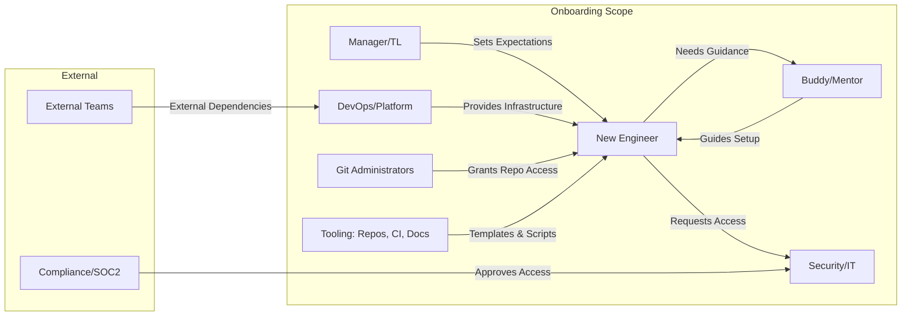
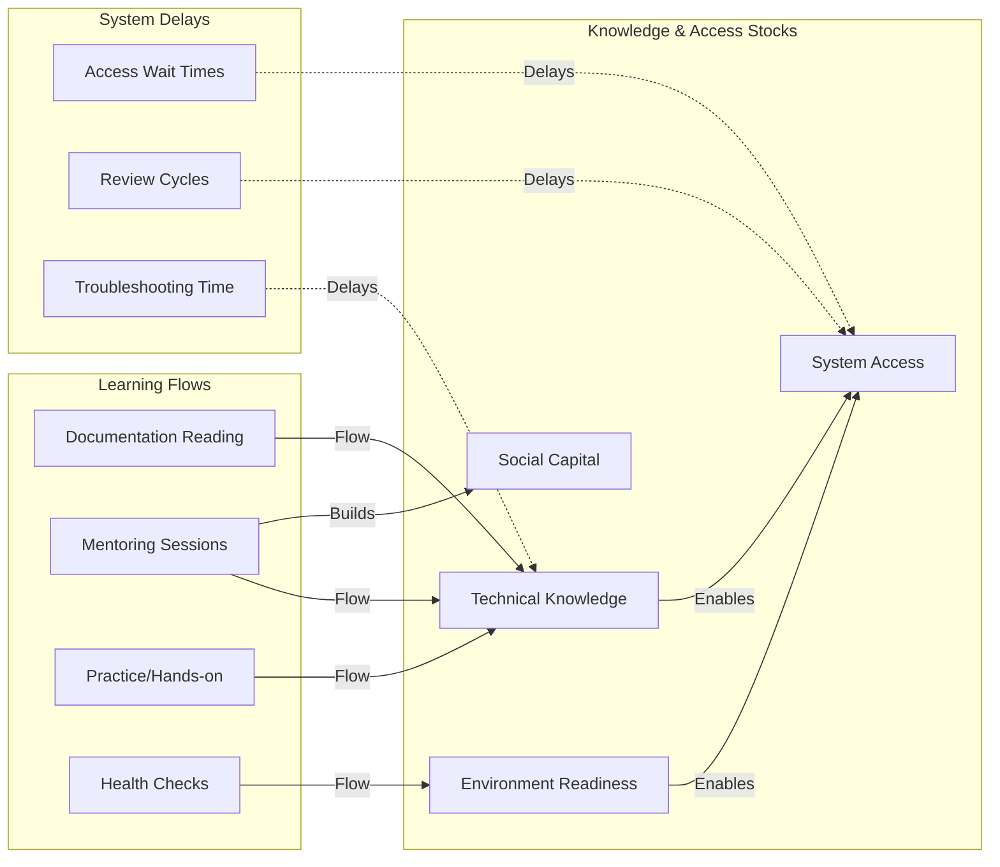
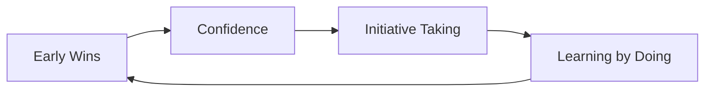
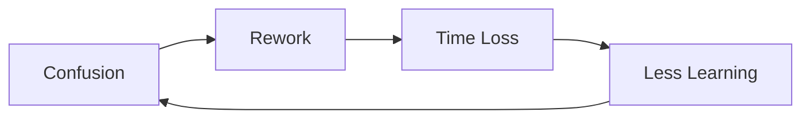
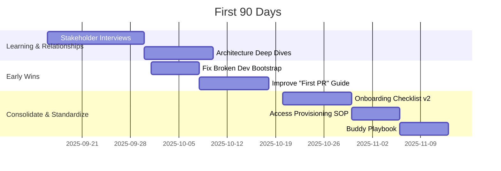

# Onboarding Documentation Analysis: Systems Thinking + First 90 Days

## 1) Executive Summary

- **Current Onboarding System:** Method's onboarding is a comprehensive but fragmented technical setup process focused on local development environment configuration. It spans sequential steps from prerequisites through local development, with extensive troubleshooting support. However, it lacks a clear progression from setup to productive contribution, missing elements like a first PR workflow, mentor assignment, and 90-day learning objectives.
- **STARS Context:** **Sustaining Success** — Established platform and processes with complex infrastructure suggest a stable environment where new engineers integrate into existing systems and improve them incrementally.
- **Top 5 Leverage Points:**
  - Automated environment validation integrated into the flow (health checks exist but not gated in the path)
  - First PR workflow and CI/CD handoff
  - Buddy/mentor assignment and cadence
  - 30/60/90 learning objectives and checkpoints
  - Onboarding success metrics (definitions of “ready”, “productive”)
- **Top 5 Unknowns + how to resolve:**
  - Buddy assignment process → Interview EM/TL; document criteria, responsibilities, cadences
  - First PR requirements and code review standards → Draft PR template and review checklist; validate with senior reviewers
  - Production access timeline under SOC2 → Map request/approval steps with Security/IT; add SOP
  - Learning objectives by 30/60/90 → Align with TLs; publish milestones
  - Success metrics definition → Agree on “Time to first PR ≤ 3 days; Time to first deploy ≤ 10 days” and supporting metrics; instrument tracking


## 2) System Boundary and Actors




## 3) Stocks, Flows, and Delays




## 4) Feedback Loops (CLDs)






## 5) Process Map: First PR to First Deploy

```mermaid
flowchart TD
  A[Day 0: Accounts Provisioned] --> B[Day 1: Repo Access & Env Setup]
  B --> C[Run Dev Bootstrap Script]
  C --> D[Open First Ticket]
  D --> E[Pair w/ Buddy]
  E --> F[Create Branch + PR]
  F --> G[CI Passes]
  G --> H[Code Review]
  H --> I[Merge]
  I --> J[Deploy to Staging]
  J --> K[Shadow On-Call / Observability Intro]
  K --> L[Small Production Change (Supervised)]
```


## 6) First 90 Days Roadmap (Watkins)




## 7) Evidence & Unknowns

- Citations from current docs:
  - Quick start and section map: `README.md` (L19–L33, L34–L50)
  - GitHub setup requirements and admins: `github-setup/README.md` (L17–L33)
  - Environment setup and critical notes: `environment-setup/README.md` (L20–L33)
  - Software installation stack and prerequisites: `software-installation/README.md` (L19–L39)
  - Troubleshooting priorities and health check: `troubleshooting/README.md` (L53–L58)
  - Health check app details: `additional-tools/health-check.md`
  - Local development health requirements: `local-development/README.md` (L34–L39)

- Unknowns & Gaps (with proposed resolution):
  - **Buddy assignment process** → Critical for ramp-up; not documented. Resolve by EM/TL interview; add `onboarding/buddy-assignment.md`. Owner: EM. Due: 2 weeks.
  - **First PR workflow and code review standards** → Missing path from setup to contribution. Resolve by drafting `onboarding/first-pr-workflow.md` and `onboarding/code-review-standards.md`. Owner: Senior Eng. Due: 2 weeks.
  - **Production access under SOC2** → Timeline/steps unclear. Resolve with Security/IT to publish `onboarding/production-access-sop.md`. Owner: Security. Due: 3 weeks.
  - **30/60/90 learning objectives** → Absent. Resolve by creating `onboarding/learning-milestones.md`. Owner: TL. Due: 2 weeks.
  - **Success metrics for onboarding** → Define and instrument TTFPR and TTFD. Resolve by adding `onboarding/metrics.md` and lightweight tracking. Owner: Platform PM. Due: 3 weeks.
  - **On-call shadowing process** → Not documented. Resolve by adding `onboarding/oncall-shadowing.md`. Owner: SRE/Platform. Due: 3 weeks.
  - **Architecture overview (current state)** → High-level map missing. Resolve by adding `onboarding/architecture-overview.md` with links. Owner: Staff Eng. Due: 4 weeks.
  - **Troubleshooting decision tree** → Many guides, no decision flow. Resolve by `troubleshooting/decision-tree.md`. Owner: Platform. Due: 2 weeks.


## 8) Documentation Improvement Plan (Prioritized Backlog)

- Impact × Effort → Priority

- **P1 (H × L): Immediate**
  - `onboarding/first-pr-workflow.md` — ticket→branch→PR→review→merge→staging. Owner: TL.
  - `onboarding/buddy-assignment.md` — assignment criteria, cadence, checklist. Owner: EM.
  - `onboarding/learning-milestones.md` — 30/60/90 goals aligned to Platform Engineering. Owner: TL.

- **P2 (H × M): Near-term**
  - Update `local-development/README.md` — add explicit health-check gate and pass/fail rubric. Owner: DevOps.
  - `onboarding/code-review-standards.md` — review checklist, approval rules, CI status requirements. Owner: Senior Eng.
  - `onboarding/checklist.md` — consolidated checklist across all sections with status boxes. Owner: Platform.

- **P3 (M × L): Quality**
  - `troubleshooting/decision-tree.md` — flow from symptom→likely cause→guide link. Owner: Platform.
  - `onboarding/architecture-overview.md` — service map and key repos with links. Owner: Staff Eng.

- **P4 (H × H): Strategic**
  - Automation: integrate `additional-tools/health-check.md` as a CLI gate in DeveloperTools bootstrap; surface a summary in docs. Owner: DevOps.
  - Onboarding metrics dashboard: track Time to First PR, Time to First Deploy, and setup SLA. Owner: Platform PM.


## 9) Watkins First 90 Days Plan (Tailored)

- **Context:** Platform Engineering; goals: Time to first PR ≤ 3 days; Time to first deploy ≤ 10 days; constraints: SOC2 access approvals; production access gated.

- **Days 1–30 (Learn & Connect):**
  - Complete environment: `README.md` → all sections; validate with Health Check.
  - Stakeholder map: TL, Buddy, DevOps, Security, Git Admins (from `github-setup/README.md`).
  - Observe delivery flow; document “First PR” gaps; deliver one PR in ≤ 3 days.

- **Days 31–60 (Align & Win):**
  - Implement PR guide and code review checklist docs; socialize in Slack/PR template.
  - Pair with Buddy to standardize bootstrap and health-check gating.
  - Ship 2–3 scoped improvements in DeveloperTools scripts to reduce setup time.

- **Days 61–90 (Consolidate & Standardize):**
  - Publish `onboarding/checklist.md` and `onboarding/metrics.md` with tracking.
  - Add production access SOP and on-call shadowing guide; pilot with next hire.
  - Propose medium-term improvements: automation for validation, ADR process.


## 10) Assumptions

- STARS classification inferred as Sustaining Success based on existing mature infrastructure and extensive troubleshooting content.
- Absence of buddy/PR/production-access docs indicates processes exist offline or in Slack; flagged as unknowns until confirmed.


## 11) Process Evidence (Where it surfaced)

- `README.md` — sequential onboarding steps and expectations (L19–L33, L90–L97)
- `github-setup/README.md` — admins, tokens, SSH, VPN note (L31–L37)
- `software-installation/README.md` — stack and prerequisites (L19–L39)
- `environment-setup/README.md` — gating conditions and delays (L20–L33)
- `local-development/README.md` — health requirements and architecture (L34–L50)
- `troubleshooting/README.md` — health check priority order (L53–L58)
- `additional-tools/health-check.md` — implementation details for validation


## 12) Next Edits to Make (exact targets)

- Add section to `local-development/README.md` under “Health Check Required” with a command snippet and pass/fail criteria referencing `additional-tools/health-check.md`.
- Create `onboarding/first-pr-workflow.md` outlining: ticket selection, branch naming, commit hygiene, CI expectations, review rules, merge strategy, staging deploy steps.
- Create `onboarding/code-review-standards.md` with checklist: tests, logging, configs, security, performance, rollback plan, documentation.
- Create `onboarding/buddy-assignment.md` with roles, 30/60/90 check-ins, escalation path.
- Create `onboarding/learning-milestones.md` mapping concepts and repos to weeks.
- Create `onboarding/production-access-sop.md` to comply with SOC2 with approval steps and owners. 