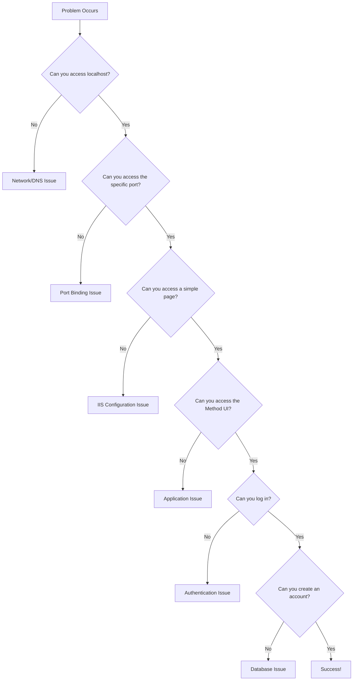

# Developing Troubleshooting Skills

## Philosophy: Learning to Solve Your Own Problems

At Method, we believe in empowering developers to solve their own problems. This isn't about being left alone—it's about developing the skills and mindset to systematically approach and resolve issues.

## Core Troubleshooting Methodologies

### 1. The 5 Whys Technique

When you encounter a problem, ask "Why?" five times to get to the root cause:

**Example:**
- **Problem**: "My local account won't load"
- **Why 1**: Because the database connection is failing
- **Why 2**: Because SQL Server isn't running
- **Why 3**: Because the service was stopped
- **Why 4**: Because it crashed due to memory issues
- **Why 5**: Because the database backup was too large for available RAM

**Root Cause**: Need to increase SQL Server memory allocation or use a smaller backup

### 2. Binary Search Debugging

When you have a large system with many components, systematically eliminate half the possibilities:

**Example - IIS Site Not Loading:**
1. **Test**: Can you access localhost? (Eliminates network issues)
2. **Test**: Can you access the specific port? (Eliminates port binding issues)
3. **Test**: Can you access the specific site? (Eliminates site configuration issues)
4. **Test**: Can you access a simple HTML file? (Eliminates application issues)

### 3. The Scientific Method

1. **Observe**: What exactly is happening?
2. **Hypothesize**: What could be causing this?
3. **Experiment**: Test your hypothesis with a specific change
4. **Analyze**: Did the change fix it? What did you learn?
5. **Document**: Record what worked for future reference

## Method-Specific Troubleshooting Framework

### Step 1: Understand the System State

Before diving into logs, understand what should be running:

```powershell
# Check all Method services
Get-Service -Name "*Method*" | Select-Object Name, Status
Get-Service -Name "MSSQL*" | Select-Object Name, Status
docker ps -a | Select-String "method|mongo|redis|elasticsearch|rabbitmq"
```

### Step 2: Use the Health Check

Our health check system is designed to give you a complete picture:

```powershell
cd C:\MethodDev\DeveloperTools\Method-HealthChecks\publish\
.\HealthCheck.App.exe
```

**What to look for:**
- **Red items**: Critical failures that prevent basic functionality
- **Yellow items**: Warnings that might cause issues later
- **Green items**: Working correctly

### Step 3: Check the Right Logs

Different problems show up in different logs:

| Problem Type | Primary Log Location | What to Look For |
|--------------|---------------------|------------------|
| Database Issues | `D:\logs\RuntimeCore\` | Connection strings, SQL errors |
| IIS/Site Issues | `C:\inetpub\logs\LogFiles\` | HTTP status codes, request failures |
| Application Errors | `D:\logs\MethodPlatformUI\` | JavaScript errors, API failures |
| System Issues | Windows Event Viewer | Service failures, permission errors |

### Step 4: Isolate the Problem

Use our decision tree approach:



## Common Problem Patterns

### Pattern 1: "It was working yesterday"

**Likely causes:**
- Service stopped (check Windows Services)
- Database backup expired
- Configuration changed
- Dependencies updated

**Debugging approach:**
1. Check what changed since yesterday
2. Restart services in dependency order
3. Verify configuration hasn't changed

### Pattern 2: "It works on my machine but not yours"

**Likely causes:**
- Environment differences
- Missing dependencies
- Configuration differences
- Permission issues

**Debugging approach:**
1. Compare environment variables
2. Check installed software versions
3. Verify file permissions
4. Test with minimal configuration

### Pattern 3: "It's slow/unreliable"

**Likely causes:**
- Resource constraints (memory, disk, CPU)
- Network issues
- Database performance
- Configuration problems

**Debugging approach:**
1. Monitor resource usage
2. Check database query performance
3. Test with different data sizes
4. Profile the application

## Building Your Troubleshooting Toolkit

### Essential Tools

1. **Health Check Application**: Your first stop for system status
2. **Log Files**: Your window into what's actually happening
3. **PowerShell**: For system administration and testing
4. **Browser Dev Tools**: For frontend debugging
5. **SQL Server Management Studio**: For database investigation

### PowerShell Scripts to Learn

```powershell
# Check all Method-related services
function Get-MethodServices {
    Get-Service | Where-Object { $_.Name -like "*Method*" -or $_.Name -like "*SQL*" -or $_.Name -like "*IIS*" } | 
    Select-Object Name, Status, StartType | Format-Table -AutoSize
}

# Test database connectivity
function Test-MethodDatabase {
    $servers = @("methodlocaldb", "localhost")
    foreach ($server in $servers) {
        try {
            $connection = New-Object System.Data.SqlClient.SqlConnection("Server=$server;Integrated Security=true;")
            $connection.Open()
            Write-Host "✓ Connected to $server" -ForegroundColor Green
            $connection.Close()
        }
        catch {
            Write-Host "✗ Failed to connect to $server`: $($_.Exception.Message)" -ForegroundColor Red
        }
    }
}

# Check Docker containers
function Get-MethodContainers {
    docker ps -a | Where-Object { $_ -match "method|mongo|redis|elasticsearch|rabbitmq" }
}
```

### Learning Resources

#### Books to Read
- **"Debugging" by David J. Agans**: Classic systematic approach to problem solving
- **"An Introduction to Thinking in Systems" by Donella Meadows**: Understanding complex systems
- **"Radical Candor" by Kim Scott**: Communication skills for getting help effectively

#### Online Resources
- [Method Troubleshooting Decision Tree](../troubleshooting/decision-tree.md)
- [General Troubleshooting Guide](../troubleshooting/general.md)
- [Log Files Reference](../troubleshooting/log-files.md)

## When to Ask for Help

### Try These First (15-30 minutes):
1. Check health check application
2. Review relevant log files
3. Restart services in proper order
4. Search existing documentation
5. Test with minimal configuration

### Ask for Help When:
- You've tried the above steps
- You're seeing errors you don't understand
- The problem seems to be affecting others
- You've found a potential bug in our system
- You need access to systems you don't have

### How to Ask for Help Effectively

**Good help request:**
```
Subject: Local account creation failing - database connection issue

I'm trying to create my first local account but getting a database connection error.

What I've tried:
- Health check shows SQL Server as green
- Can connect to methodlocaldb via SSMS
- IIS sites are running
- Error in D:\logs\RuntimeCore\error.log: "Login failed for user 'NT AUTHORITY\ANONYMOUS LOGIN'"

Environment:
- Windows 10, SQL Server 2019
- Following local-development/README.md step 3

Any suggestions for the authentication issue?
```

**Poor help request:**
```
Subject: Help

My local setup isn't working. Can someone help me?
```

## Building Confidence Through Practice

### Week 1: Basic System Understanding
- Learn to read health check results
- Understand what each service does
- Practice restarting services in order

### Week 2: Log Analysis
- Learn to find relevant log files
- Practice reading error messages
- Understand log rotation and cleanup

### Week 3: Systematic Debugging
- Practice 5 Whys on real problems
- Use binary search for complex issues
- Document solutions for future reference

### Week 4: Advanced Troubleshooting
- Profile performance issues
- Debug network connectivity problems
- Understand database query optimization

## Success Metrics

You'll know you're developing good troubleshooting skills when you can:

1. **Diagnose** 80% of common issues without help
2. **Document** solutions clearly for others
3. **Prevent** recurring problems through better practices
4. **Help** other developers with their issues
5. **Contribute** to our troubleshooting documentation

Remember: Every problem you solve makes you more valuable to the team and more confident in your abilities.

---

**Next Steps:**
- [Architecture Overview](./architecture-overview.md) - Understand the system
- [Learning Milestones](./learning-milestones.md) - Track your progress
- [First Week Schedule](./first-week-schedule.md) - Structured learning plan