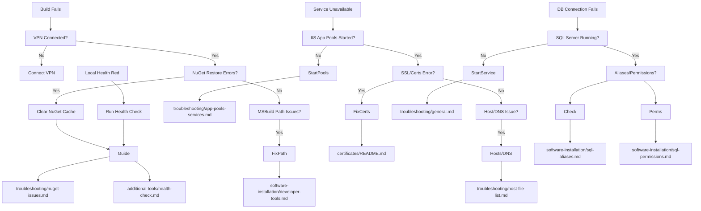

# Troubleshooting Decision Tree

Start from the symptom, follow the path, and jump to the relevant guide.

```mermaid
flowchart TD
  A[Build Fails] --> A1[VPN Connected?]
  A1 -- No --> A1n[Connect VPN]
  A1 -- Yes --> A2[NuGet Restore Errors?]
  A2 -- Yes --> A2y[Clear NuGet Cache]
  A2y -->Guide --> G1[troubleshooting/nuget-issues.md]
  A2 -- No --> A3[MSBuild Path Issues?]
  A3 -- Yes --> FixPath --> G2[software-installation/developer-tools.md]

  B[Service Unavailable] --> B1[IIS App Pools Started?]
  B1 -- No -->StartPools --> G3[troubleshooting/app-pools-services.md]
  B1 -- Yes --> B2[SSL/Certs Error?]
  B2 -- Yes -->FixCerts --> G4[certificates/README.md]
  B2 -- No --> B3[Host/DNS Issue?]
  B3 -- Yes -->Hosts/DNS --> G5[troubleshooting/host-file-list.md]

  C[DB Connection Fails] --> C1[SQL Server Running?]
  C1 -- No -->StartService --> G6[troubleshooting/general.md]
  C1 -- Yes --> C2[Aliases/Permissions?]
  C2 -->Check --> G7[software-installation/sql-aliases.md]
  C2 -->Perms --> G8[software-installation/sql-permissions.md]

  D[Local Health Red] --> D1[Run Health Check]
  D1 -->Guide --> G9[additional-tools/health-check.md]
``` 